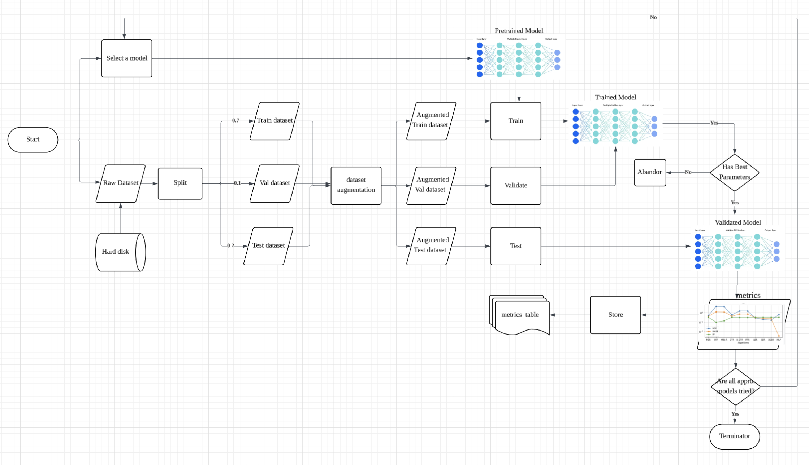

# SaintGeorgeClassify

## Table of Contents

* [Introduction](#introduction)
* [Project Features](#project-features)
* [Instructions](#instructions)
* [Technical Details](#technical-details)
* [Deployment](#deployment)
* [Github Workflow](#github-workflow)
* [Contribution](#contribution)
* [License](#licenses)
---
## Introduction
---
This project builds a reproducible end-to-end pipeline to train a binary image classifier that detects whether an image contains Saint George (positive) or not (negative). Using two provided image archives (one per class), the pipeline covers data preparation, augmentation, model selections, model training, evaluation, experiment tracking, and artifact storage so others can reproduce results quickly.

The main goal is to maximize model quality (accuracy, precision, recall, F1) through practical techniques including transfer learning (e.g., EfficientNet/ResNet), data augmentation and class balancing, hyperparameter tuning, mixed precision training, learning-rate scheduling, early stopping, and optional ensembling. Evaluation will include confusion matrices, example misclassifications, and a clear final metrics report.

---
## Project Features
---
**Data ingestion and organization**: 
Loaders to extract/validate images from the two archives, directory sanitization, and automated train/validation/test split with stratification.

**Data preprocessing & augmentation**:
Resizing, normalization, and configurable augmentations (random flip/rotation, color jitter, cutout/mixup/cutmix, lighting transforms) with easy on/off settings.

**Model architectures**:
This project selects 3 computer vision artificial intelligence (AI) models for the binary classification task: EfficientNet, ResNet, and Vision Transformer. 

EfficientNet and ResNet are convolutional neural networks specialized in extracting features from images and performing image classification. They are highly effective at capturing local patterns and details within images. In contrast, Vision Transformers (ViT) are an innovative model based on the Transformer architecture, leveraging the powerful context-understanding capabilities of Transformers. Unlike convolutional models that process image patches locally, ViT considers the entire image holistically, relating different patches through self-attention mechanisms. This allows ViT to capture global context, resulting in more accurate and robust feature extraction, especially for complex visual tasks.

In the future, the project may be extended to allow users to provide their own custom AI models for this classification task, increasing flexibility and customization.

**Training pipeline**:
Training loop with gradient accumulation, validation, and early stopping.

**Loss & metrics**:
Binary cross-entropy, and real-time logging of accuracy, precision, recall, F1 on epoch-levels.

**Experiment tracking & logging**:
Integrated logging via logging module with automatic saving of best parameters for each model.

**Hyperparameter tuning**:
For each model, hyperparameters are fine-tuned based on learning rates and weight decay rates using grids. The best hyparameters are selected based on the validation results.

**Evaluation & analysis tools**:
Confusion matrix and some misclassification with explainations.

**Inference & Deployment**:
Colab notebooks are ideal for experimentation, prototyping, and development due to their interactive and flexible environment. They enable rapid testing of ideas, parameter tuning, and visualization of results. Therefore, for research, experimentation, or proof-of-concept purposes, deploying the project is unnecessary until it is ready for real-world use or public accessibility.

This project is publicly available on GitHub as an open-source repository with continuous integration (CI) powered by GitHub Actions. Whenever a new notebook is pushed to the main branch, an automated workflow is triggered that inspects and executes all cells in the notebook. Only after passing these tests and validations will the changes be accepted into the main branch.

**Reproducibility**:
The CI feature automatically executes all cells in the notebook on a dedicated Ubuntu server, ensuring that the notebook runs successfully without any errors before allowing a merge into the main branch. This process demonstrates the reproducibility and reliability of the release. Additionally, the notebook begins with environment setup at the very start, and since the code runs on Google Colab's server rather than the user's local machine, the reproducibility of results is highly trustworthy.
Overall, the notebook content is portable and independent of user's machine.

---
## Instructions
---
Here are the instructions for using your Colab setup effectively:

---

### Overview:
This Colab notebook leverages the power of Google's extensive GPU infrastructure, making it ideal for users with limited local GPU resources. It is fully cross-platform, allowing anyone to run the code regardless of their operating system. The notebook provides real-time logs and print outputs, making monitoring and debugging straightforward without the need for tedious save operations involving I/O,thus streamlining your workflow. **The Colab notebook is provided as SaintGeorgeClassify.ipynb.** One can feel free to download and upload it to any Google Colab platform for re-runing.

**How to Use:**  

1. **Download SaintGeorgeClassify.ipynb:** \
   Download the SaintGeorgeClassify.ipynb file in this Github Repository either manually or git clone this repository, and then upload it to any Google Colab platform.

3. **Change Workspace on the notebook:** \
   Change the workspace in the second cell by uncommenting `WORKSPACE = /content/drive/MyDrive/SaintGeorgeClassify` and commenting `WORKSPACE = SaintGeorgeClassify`. Rationale: CI runs the notebook on an Ubuntu server where the default directory layout can conflict with local or mounted paths. Pointing `WORKSPACE` to a dedicated folder (e.g., a path under Google Drive or a project-specific directory) avoids disk/path conflicts between the CI environment and Colab, ensuring cells execute reliably both locally and in CI.

5. **Select appropriate runtime:** \
   Select an appropriate runtime which includes runtime type, GPU specification, and RAM size. One can select `Runtime` option on the top bar of the Colad webpage, then select `Change Runtime`. A window will then pop up. Please select **Python3** as the `runtime type`, anything you want for `Hardware Accelerator`, and **Latest** as the `Runtime Version`. 

6. **Start by running cells one by one:**  
   Click on each cell and execute sequentially to initialize your environment, load data, and run your analysis. This step-by-step approach ensures smooth execution and easy debugging. Please note that the design follows established software design patterns and architecture principles, ensuring that dependencies are installed and loaded in the correct order within the environment. This structured approach helps maintain modularity, reproducibility, and clarity throughout the development process.

7. **Clear Cache When Necessary:**  
   If you encounter memory issues or need to reset the environment, manually clear the cache by using the "Runtime" menu → "Factory reset runtime" or by restarting runtime via **Runtime > Restart runtime**. This will free up memory and allow for fresh execution.

8. **Monitor Outputs in Real-Time:**  
   All logs, print statements, and outputs are shown immediately below each executed cell. Use this to monitor your progress, debug, and verify intermediate results on the fly.

9. **Save Outputs Manually:**  
   The outputs, such as trained models, results, or important logs, can be copied directly from the output cells and saved on your local device at your convenience. This manual save process is encouraged as it allows you to select and store critical data selectively, providing flexibility over automated saving.

**Feel free to follow these steps for a smooth and efficient experience while leveraging Colab’s powerful environment.**

### Architecture:

---
## Technical Details
---
Due to the time-consuming nature of training models and the inherent uncertainty and potential slowdown of I/O operations, the code employs **multi-threading** techniques to mitigate crash risks and improve stability. Specifically, each model training process runs in its own independent thread, ensuring that a failure in one training process does not affect or crash others. Additionally, I/O-related tasks such as saving metrics graphs to disk are executed in separate threads, maintaining the smoothness and reliability and responseness of the main training process.

Furthermore, the code adheres to **SOLID principles** of software design (which will be stated in more details in the section of *Coding Standards and Guidelines*), which bolster robustness, facilitate scalability, and simplify debugging. This structured approach enhances maintainability and prepares the project for future expandability.

## Development requirements
---
For development purposes, the primary requirement is that users work within the notebook environment. This allows for easy experimentation, visualization, and iterative development without the need for setting up complex environments or dependencies outside of the notebook.

Furthermore, since the code runs on Google Colab servers, it is important to monitor network conditions through the browser. **Network latency** or **disconnections** can sometimes cause delays, making it seem like the training is stalled when, in fact, it is due to network issues. To diagnose this, you can right-click and select "Inspect" or press F12 to open the developer tools and check the connection status, ensuring that the network is active and stable.

### OS requirement
All operating systems support Google Colab at the moment.

### Network requirement
Reliable internet connection is essential.

---
## Deployment
---
The project may be deployed in the future for public real-world use.

---
## Github Workflow
---

1. **Default Branches**

   * `main` : Holding the Google Colab notebook
   * `production`: TBA.
     
2. **Continuous Integration (CI)**
   * CI/CD Setup: Use GitHub Actions for
     * Standardize the Pull Request Format
     * Automated test
     * Deployment pipelines

## Coding Standards and Guidelines

We follow software design industrial standard and guidelines, SOLID, as a reference:

**Single Responsibility Principle (SRP)**:
A class should have only one reason to change, meaning it should have only one responsibility or job.

**Open/Closed Principle (OCP)**:
Software entities (classes, functions, modules) should be open for extension but closed for modification. You should be able to extend functionality without altering existing code.

**Liskov Substitution Principle (LSP)**:
Subtypes must be substitutable for their base types without affecting correctness. This ensures subclasses behave consistently with their base class.

**Interface Segregation Principle (ISP)**:
Clients should not be forced to depend on interfaces they do not use. Instead of large, monolithic interfaces, prefer smaller, specific ones.

**Dependency Inversion Principle (DIP)**:
High-level modules should depend on abstractions, not on concrete implementations. This decouples code and improves flexibility.

## Contribution
Xuerong (Snow) Zhou (kaixinrongzi)

## Licenses

We will not be licensing our codebase as the agreement does not allow disclosure upon coding.
