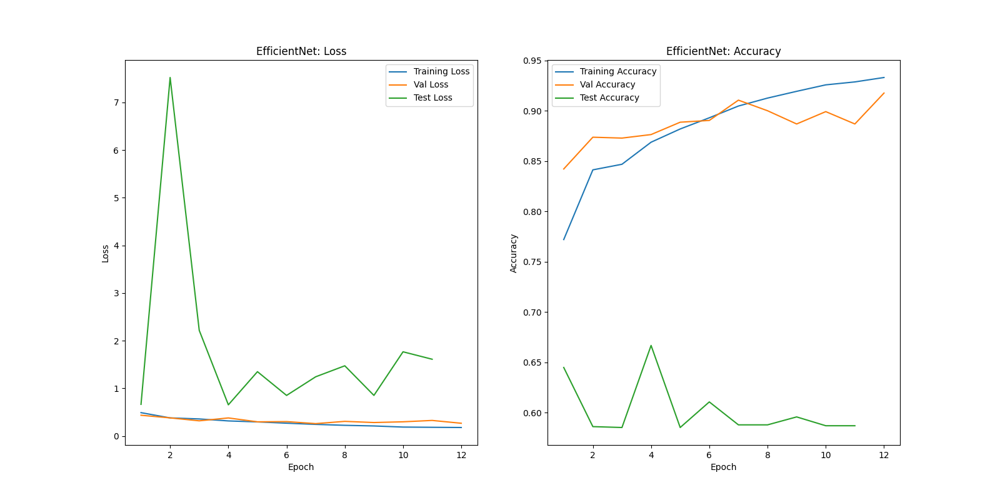
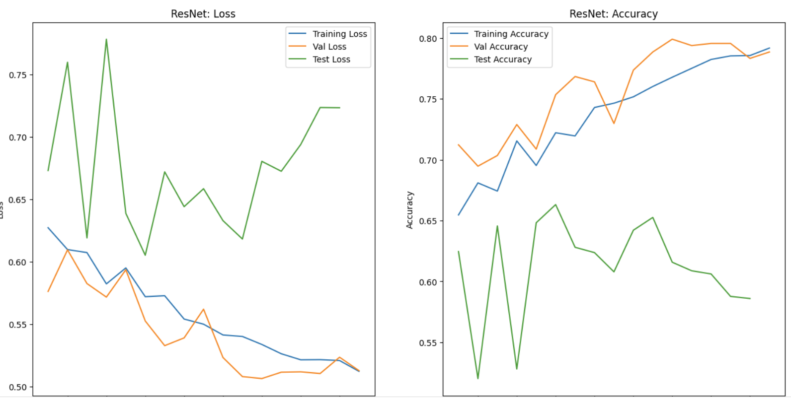
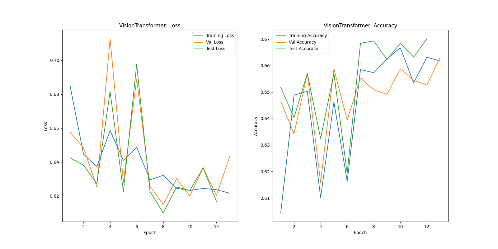

# Experiment Report: Image Classification of Saint George Pictures

## Dataset Description
The dataset contains `5570` images and consists of two categories: `positive` (containing Saint George) and `negative` (non-Saint George). The positive class accounts for approximately `40%` of the dataset, while the negative class makes up about `60%`. Both classes feature images with relatively consistent artistic styles, primarily depicting artistic renditions of Saint George, such as paintings or sculptures, which helps maintain stylistic coherence across the dataset.

The negative (non-Saint George) images are highly diversified. They include a wide variety of subjects, such as portraits of people, everyday objects, animals, and more abstract or unrelated scenes. This diversity introduces variability that can challenge the model’s ability to distinguish Saint George images based solely on content. Similarly, the Saint George images themselves exhibit substantial diversity. They encompass sculptures, painted portraits, images of currency with George’s portrait, and other artistic representations. This intra-class variability underscores the importance of robust feature extraction to accurately identify Saint George across different styles and formats.

## Approach
In this project, we employed three state-of-the-art `models—ResNet`, `EfficientNet`, and `VisionTransformer(ViT)` —to perform binary classification of Saint George images. `ResNet` was selected for its deep residual learning capabilities, allowing effective extraction of local, fine-grained features. `EfficientNet` was chosen for its optimized balance of accuracy and efficiency, making it suitable for non-complext tasks such as binary classification. `ViT`, leveraging self-attention mechanisms, was included to explore the benefits of global context modeling for complex visual patterns.

The models were pretrained on ImageNet, facilitating transfer learning and reducing training time, with fine-tuning performed on the task-specific dataset. The choice of these architectures provides a diverse set of feature extraction strategies—local, efficient, and global—allowing comprehensive evaluation and comparison to determine the most effective approach for the classification of Saint George images.

To improve the robustness and generalization capability of the models, several data augmentation methods are employed during training. `Random rotations` introduce orientation variability by rotating images within a specified range, enabling the model to recognize objects regardless of their angle. `Flipping` images, such as horizontal flips, simulate different viewpoints and mirror images, helping the model become invariant to left-right changes. `Color jitter` varies image attributes like brightness, contrast, saturation, and hue, mimicking real-world lighting and environmental variations, which prevents the model from over-relying on specific color features. 'Cutout' removes a random part of images, improving images variants and mitigating overfitting issues.

In addition to augmentations applied directly to the images, batch normalization is used within the neural network architecture to normalize the inputs for every mini-batch. This technique remove outliers of inputs from affecting models performance, stabilizes and accelerates training by maintaining consistent input distributions, ultimately leading to faster convergence and improved model performance. Collectively, these augmentation strategies enhance the diversity of training data and promote learning of more robust and invariant features, resulting in a model better equipped to handle real-world variations.

## Models Used
- ResNet
- EfficientNet
- ViT

## Training Configuration
- Number of Epochs: 20
- Learning Rate: 0.001
- Weight Decay: 1e-6
- Optimizer: AdamW

## Data Augmentation Techniques
To improve model robustness and generalization, the following augmentations were applied:

- Random horizontal flip
- Color jitter (brightness, contrast, saturation, hue variations)
- Random rotation within a reasonable angle range
- Pixel normalization to match pretrained model standards

## Rationale
### Models Selection
Overall, we used pretrained models to take advantage of knowledge transferring power from previous training.

The chosen models leverage different strengths:

`ResNet` and `EfficientNet` are convolutional architectures optimized for feature extraction, effectively capturing local patterns in images. `ResNet` is well-known for its residual connections, which alleviate the vanishing gradient problem and enhance the training of very deep networks. Empirically, `ResNet` excels at extracting fine-grained, local features, aiding in identifying small details characteristic of Saint George images. Besides, `ResNet` was trained on 1 million images across a quite broad range of 1000 classes, making its pretrained weights to play an essential role of classifying Saint George in our dataset.

`EfficientNet`, originating from MobileNetV2, employs a systematic scaling approach that balances accuracy and efficiency. For relatively simple tasks like binary classification, its application is justified by the need for faster training and inference without significantly sacrificing performance. Similar to `ResNet`, `EfficientNet` was trained on the same dataset to capture almost all kinds of features.

`ViT` (Vision Transformer) adopts the Transformer architecture successfully used in NLP, adapted for vision tasks. It leverages self-attention mechanisms to capture global context by relating different parts of the image across its entire input. Unlike CNNs, which focus on local features, `ViT` can recognize complex patterns and relationships holistically, often leading to superior performance on challenging vision tasks. Although it may not be essential for this specific task, including `ViT` for comparison provides valuable insights into different modeling approaches.

### Optimizer Selection
We choose `AdamW` as the optimizer because AdamW is an optimization algorithm that combines the adaptive learning rate benefits of Adam with a better handling of weight decay regularization. Unlike Adam, AdamW decouples weight decay from the gradient-based update, allowing us to apply weight decay as a separate step, leading to more effective regularization. Also, AdamW has empirical success recently by studies and experiments have shown that AdamW generally outputperforms or matches Adam.

### Hyperparameters Selection
- Learning rate: We selected `0.001` as the learning rate because it is a commonly used starting point in deep learning by providing a good balance between convergence speed and training stability. Besides, this value tends to work well with optimizer like AdamW for most image classification tasks, allowing the model to converge steadily towards optimal parameters.
- Weight decay: The weight decay serves as a regularization factor to prevent overfitting, especially important in datasets that are imbalanced, which is exactly this dataset our project works on. It applies a small penalty to large weights, mitigating the features that correspond to large weights to overwhelm the classification results. Thus, it encourages model to learn more generalized features. The value of `1e-6` is relatively mild, providing regularization without overly constraining the model, thereby maintaining learning flexibility and stability.
- Epoch number: We selected `20` as the epoch number based on empirical observations and time efficiency. Through prior experiments, it’s observed that models tend to reach satisfactory accuracy within around 20 epochs, especially when transfer learning with pretrained models is involved. Besides, raining models for more than 20 epochs can be time-consuming, especially during development cycles. Starting with 20 epochs provides a reasonable training window to evaluate model performance. Last, it’s common to train for a limited number of epochs first and then use early stopping or validation metrics to determine if more training is necessary. If models haven't stabilized or plateaued by epoch 20, additional training or hyperparameter tuning can be considered.

## Experiments
### Overfitting Issue
During the training of all three models (`ResNet`, `EfficientNet`, and `ViT`), I encountered severe overfitting, with the models performing well on training data but poorly on validation data. Although the training and validation accuracy could achived over 95% by all of our models, their testing accuracies ranges from 44% to 58%, which did not outperform a random guess (50%). To address this, I implemented several techniques aimed at improving generalization and preventing overfitting:

- Early Stopping:
I integrated early stopping based on validation loss. During each epoch, the model's performance on the validation set was monitored. If the validation loss did not decrease for a predefined number of epochs (patience parameter), the training process was automatically halted. This approach prevents overtraining, reduces the risk of overfitting, and ensures that the model retains parameters corresponding to the best validation performance. It also conserves computational resources by stopping training once the model stops improving.

- Data Augmentation with Cutout:
To increase the robustness of the `ViT` model and reduce reliance on specific image regions, I added the Cutout augmentation method to the training pipeline. During each training iteration, random rectangular sections of input images were masked out (filled with zeros). This compels the models to learn features that are distributed across the entire image and helps them recognize objects even when parts are occluded or missing. This technique is particularly effective in scenarios with high intra-class variability, as it enforces the model to focus on global cues rather than local, dominating features.

- Increased Weight Decay:
To further regularize the models and discourage over-reliance on large weights, I increased the weight decay parameter (L2 regularization). This penalty term encourages the network to favor smaller weights, helping the models focus on learning more generalizable features, rather than overly specialized features, reducing the tendency to memorize training details and ultimately improving performance on unseen data.

These strategies helped reduce overfitting across all models. As a result, test performance improved: **all models now exceed 58% accuracy**, with the Vision Transformer reaching approximately 67% accuracy.

### Training Time Consumption
Given limited compute and a tight timeline, I balanced model quality with training efficiency. Training multiple deep architectures (`ResNet`, `EfficientNet`, `ViT`) can be slow, so I ran the three trainings concurrently using **multithreading** to observe their behavior **in parallel**. This allowed rapid feedback on whether training was proceeding correctly and which models produced promising outputs, enabling quick identification of poor hyperparameter choices and providing a practical starting point for further tuning.

## Results
### Time Complexity
- `ResNet` takes 2 minutes per epoch on average
- `EfficientNet` takes slightly over 1 minutes per epoch on average
- `ViT` takes 3 minutes per epoch on average
Overall, `EfficientNet` is the most efficient network due to its smaller amount of parameters, `ResNet` ranks in the middle, and `ViT` takes the longest time to process due to is complexity nature.

### Metrics
#### Loss and Accuracy
**EfficientNet**

**ResNet**

**ViT**

### Model Evaluation
| Model | Test Accuracy| Precision | Recall  |  F1 Score  |
|----------|----------|----------|-----------|----------|
| EfficientNet | 58.77% | 62.50% |1.06% |2.08% | 
| ResNet | 61.58% | 85.42% |8.69% | 15.77% | 
| ViT | **67.37%** | 63.97% |48.52% | 55.18%|

Among the three models, `ViT` demonstrates the strongest overall performance, with the highest accuracy at approximately 67.4%. It also significantly outperforms `ResNet` and `EfficientNet` in recall (48.5%), indicating a better ability to identify positive cases. Although its precision (63.97%) is moderate, the improved recall results in a higher F1 score (~55.2%), reflecting a better balance between precision and sensitivity.

`ResNet`, despite having the highest accuracy among the CNNs, exhibits a very low recall (~8.7%), implying it largely fails to detect positive samples. This indicates that `ResNet` may be biased towards the negative class, potentially limiting its usefulness depending on the application.

`EfficientNet` performs worse overall, with an accuracy of about 58.8%, and very low recall (~1.06%), suggesting it struggles with identifying positive samples.

#### Summary:
`ViT` appears most promising for this task, offering the best trade-off between accuracy and recall. To further improve the models, especially in detecting positive cases,  data augmentation, dataset balance improvement to 50/50, or additional tuning could be explored.

